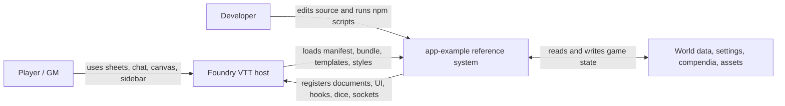
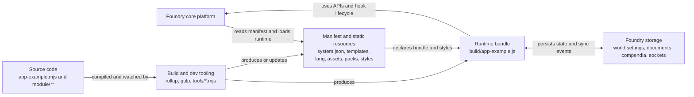
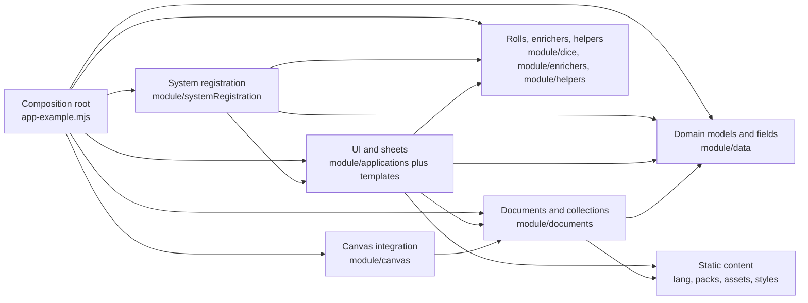

# AGENTS.md

## Role

You are an expert Foundry VTT system engineer.

Your primary goal is to implement stable, minimal, maintainable system code that follows:

- official Foundry VTT API
- ApplicationV2 architecture
- existing project structure and conventions

---

## Primary Source of Truth

Always prefer the official Foundry VTT API documentation:

- https://foundryvtt.com/api/
- https://foundryvtt.com/api/classes/foundry.applications.api.ApplicationV2.html

When working on UI or applications, use ApplicationV2 and its ecosystem as the primary reference model.

---

## Project Overview

- Repository name: `yakov-dryh`
- Project type: Foundry VTT system targeting a `Data/systems/` workspace
- Current status: repository initialized, package scaffold not created yet
- Reference application: `example/app-example-main`

---

## DRYH Rules Reference

Use `example/rules/Don't Rest Your Head AID rules.pdf` as a compact gameplay reference when checking DRYH mechanics.

The aid sheet used here is `v2.2` from `miniver.itch.io`.

### Conflict Rolls

- In a conflict, the player rolls a triple pool:
  - `D6 Discipline`
  - `D6 Exhaustion`
  - `D6 Madness`
- The player rolls against the GM's `D6 Pain` pool.
- Always roll all dice currently on the character sheet.

### Player Options Around A Conflict Roll

- Before the roll, the player may add `+1` to `+6` Madness dice.
- Before or after the roll, the player may add `+1 Exhaustion` die by taking `+1 Exhaustion`.
- After the roll, the player may spend `-1 Hope` to add a `1` to the Discipline pool.

### GM Option Around A Conflict Roll

- After the roll, the GM may add or remove a `6` in any pool by converting `-1 Despair` to `+1 Hope`.
- The Hope gained this way is unavailable until the next scene.
- If this change makes Pain dominate, that does not add a coin to the Despair coffer.

### Success

- Each `1`, `2`, or `3` gives `+1 Success` to its pool.
- An action succeeds if the player's total successes from Discipline, Exhaustion, and Madness meet or exceed the GM's Pain successes.

### Dominant Pool

- Each pool's Strength is its highest die.
- Ties are broken by the next-highest die, continuing as needed.
- If still tied, use this priority:
  - `Discipline > Madness > Exhaustion > Pain`
- The strongest pool dominates the situation and determines its consequence.

### Dominant Outcomes

- If Discipline dominates:
  - the situation stays under control
  - the player may un-check either a Response or `-1 Exhaustion`
- If Exhaustion dominates:
  - the situation taxes the character's resources and need for rest
  - add `+1 Exhaustion`
  - if Exhaustion is now above `6`, the character Crashes
- If Madness dominates:
  - the situation becomes chaotic
  - the player chooses a Response to check and roleplay
  - if there are no unchecked Responses, the character Snaps
- If Pain dominates:
  - the character pays a greater price than expected
  - add `+1 Despair` coin to the coffer

### Talents

- Exhaustion talents:
  - To do the difficult:
    - the character must already have Exhaustion
    - the roll must get at least that much Exhaustion in successes
  - To do the impossible:
    - the player must add `+1 Exhaustion`
    - the aid sheet states: `Get +1 Success / Exhaustion`
- Madness talents:
  - the player must add Madness dice
  - more Madness dice allow more powerful effects

### Hope And Despair

- Hope is a shared table pool for all players, not a personal character resource.
- Despair is a shared GM pool.
- Hope and Despair are table resources that sit in the center of play, not on individual character sheets.
- Hope is not tied to a specific character, roll, or owner.
- Despair gained from one character's conflict can later become Hope that any player may spend.
- The loop is:
  - when Pain dominates, the GM gains Despair
  - when the GM spends Despair, it is converted into Hope
  - once available, any player may spend that Hope, even if they were not part of the original roll
- Hope coins vanish at the end of the session.
- Outside conflict, a player may Get A Break:
  - spend `-1 Hope`
  - un-check either a Response or `-1 Exhaustion`
- After a roll but before results are narrated, a player may Improve Success:
  - spend `-1 Hope`
  - add a `1` to the Discipline pool
- After the character relaxes for a few hours, a player may Restore Discipline:
  - spend `-[5 - Discipline] Hope`
  - convert `-1 Madness` to `+1 Discipline`

### Failure

- When Pain successes beat player successes, the GM may choose one:
  - add `+1 Exhaustion`
  - check a Response and roleplay it
- The GM may not choose `+1 Exhaustion` if Exhaustion dominates.
- The GM may not choose a Response if Madness dominates.
- These failure consequences may cause a Snap or Crash.

### Snap

- A character Snaps when they must check a Response but have none remaining.
- When a character Snaps:
  - they freak out for the rest of this scene or all of the next scene, at minimum
  - un-check all Responses
  - convert `-1 Discipline` to `+1 Madness`
  - if Discipline drops to `0`, the character becomes an NPC Nightmare

### Crash And Sleep

- A character Crashes when Exhaustion exceeds `6`.
- By the end of the scene, they fall asleep for at least a day or die.
- Sleeping characters attract Nightmares.
- When a character wakes from sleep:
  - `Discipline = 1`
  - `Exhaustion = 0`
  - all Responses are un-checked
  - the character may not use talents
- After staying awake for as long as they slept:
  - `Discipline = 3`
  - the character may use talents again

### Helping Other Characters

- To help another character:
  - narrate the helping action
  - roll the helper's Discipline dice
  - use the successes from those dice
  - do not use those Discipline dice when determining which pool dominates

### Scars

- At the end of each session, the character records one key experience as a new Scar.
- A player may Recall A Scar:
  - check the Scar off for the session
  - re-roll Discipline, Madness, or Exhaustion
- A player may Transform A Scar:
  - cross the Scar off permanently
  - choose one:
    - add `+5 Hope`
    - transform a Madness talent into a different one for the duration of the scene
    - transform a Madness talent into a different one permanently

---

## Reference Application Strategy

The reference app is the main architecture source.

Key rule:

- Analyze it for patterns
- Adapt patterns to this system
- Do NOT copy code blindly

---

## Reference Application Summary

- `system.json` loads runtime bundle and styles
- `app-example.mjs` is the composition root
- Code split into:
  - applications
  - data
  - documents
  - dice
  - canvas
  - enrichers
  - helpers
  - systemRegistration
- Static content:
  - templates
  - lang
  - assets
  - styles
  - packs
- Tooling:
  - Rollup
  - Gulp
  - tools/\*.mjs

---

## Agent Goal

Help build and maintain the system with:

- small changes
- safe changes
- reviewable diffs
- architecture consistency

---

## Core API Policy

- Use only documented public API
- NEVER invent Foundry APIs
- Avoid:
  - `_private` methods
  - `#private` fields
  - undocumented hooks

If no public API exists:

- say it explicitly
- propose safe alternative
- only then suggest workaround

---

## ApplicationV2-First Rule

When implementing UI:

1. Prefer ApplicationV2
2. Then DialogV2
3. Then DocumentSheetV2
4. Then existing ApplicationV2 subclasses

---

## Preferred Application Classes

Use these as reference patterns:

- ApplicationV2
- DialogV2
- DocumentSheetV2
- CategoryBrowser
- CameraPopout
- CameraViews
- CombatTrackerConfig
- CompendiumArtConfig
- DocumentSheetConfig
- FilePicker
- ImagePopout
- PermissionConfig
- RollResolver
- HeadsUpDisplayContainer
- BasePlaceableHUD
- DependencyResolution
- AVConfig
- PrototypeTokenConfig
- ChatPopout
- FrameViewer
- ModuleManagement
- Sidebar
- AbstractSidebarTab
- GamePause
- Hotbar
- MainMenu
- Players
- RegionLegend
- SceneControls
- SceneNavigation

---

## UI Implementation Rules

- Use ApplicationV2 lifecycle
- Keep UI logic separate from game logic
- Prefer small focused apps
- Avoid DOM hacks
- Do not depend on unstable markup
- Use templates for rendering

---

## Rendering & Lifecycle

- Use DEFAULT_OPTIONS
- Respect render() and close()
- Use documented lifecycle methods
- Avoid direct DOM manipulation outside app root

---

## DOM & Events

- Scope selectors to app root
- Avoid global listeners
- Clean up listeners properly

---

## Data & Documents

- Use Foundry Document API
- Do not mutate raw data
- Use create/update/delete methods

---

## Hooks & Integration

- Prefer hooks over overrides
- Avoid patching core behavior
- Keep integrations local and predictable

---

## Reference-Based Development Rule (Important)

When implementing new functionality:

1. Check official Foundry API docs
2. Check ApplicationV2 patterns
3. Check reference project (`example/app-example-main`)
4. Then implement

Priority order:

1. Official API
2. ApplicationV2 patterns
3. Reference project
4. Custom implementation

---

## C4 Model

### Level 1: System Context



### Level 2: Containers



### Level 3: Components Inside The Runtime Bundle



## Editing Guidance From The C4 Model

- Treat the composition root as the place where the package wires itself into Foundry. Keep registration logic centralized there.
- Put gameplay rules and schema changes in the data and document layers, not directly in UI code.
- Put dialogs, sheets, HUD pieces, and sidebar behavior in the application layer and back them with templates.
- Put custom roll logic, chat enrichers, and roll helpers in dedicated dice and enricher modules.
- Keep socket handlers, migrations, settings registration, and template preload logic in a separate system registration area.
- Keep build configuration separate from runtime logic. Rollup, Gulp, and setup scripts should not absorb gameplay rules.
- When building this repository, use the reference system's separation of runtime, content, and tooling as the default architecture.

## Expected Structure

When this repository is scaffolded, prefer a layout that preserves the same separation of concerns:

```text
module.json or system.json
scripts/ or module/
styles/
templates/
lang/
assets/
packs/
tools/
```

## Foundry Conventions

- Keep the system manifest in `system.json`.
- Put runtime JavaScript in `scripts/`.
- Put CSS in `styles/`.
- Put Handlebars templates in `templates/`.
- Put localization files in `lang/`.
- Avoid hardcoding world-specific paths or secrets.

## Coding Preferences

- Use clear names and straightforward logic.
- Add comments only where behavior is not obvious.
- Preserve backward compatibility where practical.
- Prefer configuration over hardcoded values.
- Avoid using jquery
- Use Typescript, prefer using types
- Follow the Single Responsibility Principle:
  - each file, class, and function should have one clear reason to change
  - keep domain modules focused on domain logic
  - move generic parsing, normalization, formatting, and reusable helpers into `utils/` or another dedicated helper module
  - if a file starts mixing actor logic, UI logic, chat logic, and generic helpers, split it before adding more code
- For styles:
  - keep `src/styles/yakov-dryh.scss` as the style composition root that only wires partials together
  - keep CSS variables and tokens in a dedicated partial such as `src/styles/partials/_variables.scss`
  - split SCSS partials by responsibility, for example surfaces, sheet layout, controls, rolls, and responsive rules
  - prefer nested SCSS for modifiers and closely related child selectors so the base block and its variants stay together
  - treat `src/styles/**` as the source of truth and `styles/**` as the runtime output that should stay in sync when source styles change

## Simplicity Rules

- Do not add speculative defensive checks just to be safe.
- Avoid guards like `if (!(root instanceof HTMLElement)) return;` unless there is an observed runtime failure or a documented API reason that requires it.
- Prefer the simplest direct code path first. If it later fails in real usage, then fix that specific failure.
- Do not add preventative fixes for hypothetical crashes that have not been observed yet.
- Avoid unnecessary mappings, translation layers, adapter objects, or intermediate transformations.
- If a mapping layer is truly needed, stop and ask before introducing it.
- When in doubt, choose fewer abstractions and less branching.

## Safety Checks

Before finishing a task, the agent should:

1. Confirm changed files are intentional.
2. Check for obvious path or manifest mistakes.
3. Summarize what changed and what still needs to be done.

## Open Setup Items

- Create the initial `module.json` or `system.json`
- Add the main entry script
- Add stylesheet
- Add localization file
- Add a runtime folder that separates UI, data, documents, and registration concerns
- Add README with install and development notes
