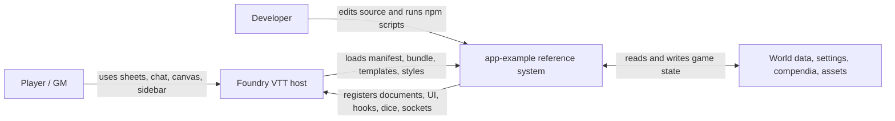
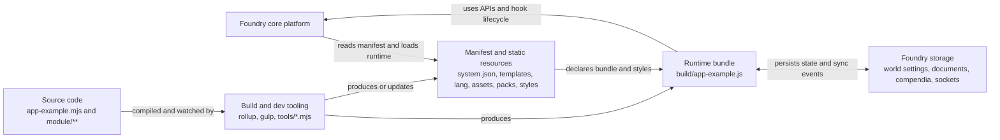
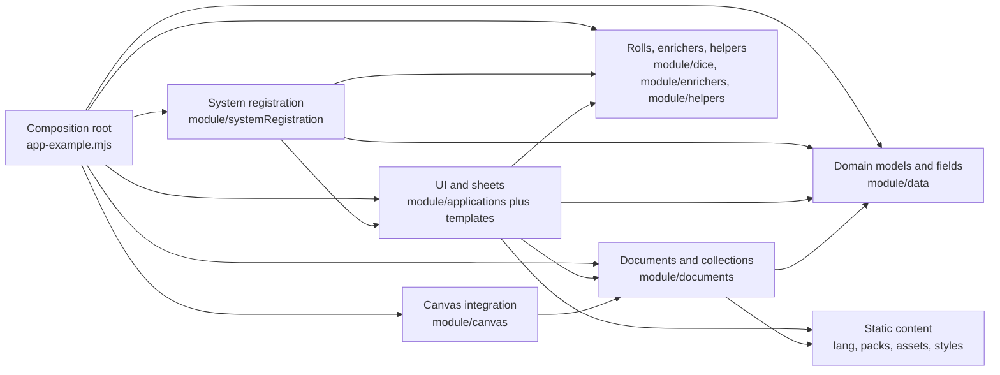

# AGENTS.md

## Project Overview

- Repository name: `yakov-dryh`
- Project type: Foundry VTT package in a `Data/modules/` workspace
- Current status: repository initialized, package scaffold not created yet
- Reference application: `example/app-example-main`

## Reference Application Summary

The reference app in `example/app-example-main` is a full Foundry VTT system.
Use it as the main architecture reference until this repository has its own runtime structure.

Key findings from the analysis:

- `system.json` is the runtime manifest and loads `build/app-example.js` and `styles/app-example.css`.
- `app-example.mjs` is the composition root. It wires `CONFIG`, hooks, sockets, sheet registrations, dice, enrichers, and canvas integration.
- Runtime code is split into `module/applications`, `module/data`, `module/documents`, `module/dice`, `module/canvas`, `module/enrichers`, `module/helpers`, and `module/systemRegistration`.
- Static support content lives in `templates`, `lang`, `assets`, `styles`, and `packs`.
- Development uses Rollup for the JS bundle, Gulp for LESS to CSS, and `tools/*.mjs` scripts for local Foundry setup and startup.

## Agent Goal

Help build and maintain this Foundry VTT module with small, safe, reviewable changes.

## Working Rules

- Prefer minimal diffs and keep the repo easy to understand.
- Do not remove or overwrite user content unless explicitly requested.
- Keep paths and filenames stable once the module scaffold exists.
- When adding new files, follow the expected Foundry module layout.
- Document new commands, scripts, and assumptions in this file or `README.md`.

## C4 Model

### Level 1: System Context



### Level 2: Containers



### Level 3: Components Inside The Runtime Bundle



## Editing Guidance From The C4 Model

- Treat the composition root as the place where the package wires itself into Foundry. Keep registration logic centralized there.
- Put gameplay rules and schema changes in the data and document layers, not directly in UI code.
- Put dialogs, sheets, HUD pieces, and sidebar behavior in the application layer and back them with templates.
- Put custom roll logic, chat enrichers, and roll helpers in dedicated dice and enricher modules.
- Keep socket handlers, migrations, settings registration, and template preload logic in a separate system registration area.
- Keep build configuration separate from runtime logic. Rollup, Gulp, and setup scripts should not absorb gameplay rules.
- When building this repository, use the reference system's separation of runtime, content, and tooling as the default architecture.

## Expected Structure

When this repository is scaffolded, prefer a layout that preserves the same separation of concerns:

```text
module.json or system.json
scripts/ or module/
styles/
templates/
lang/
assets/
packs/
tools/
```

## Foundry Conventions

- Keep the module manifest in `module.json`.
- Put runtime JavaScript in `scripts/`.
- Put CSS in `styles/`.
- Put Handlebars templates in `templates/`.
- Put localization files in `lang/`.
- Avoid hardcoding world-specific paths or secrets.

## Coding Preferences

- Use clear names and straightforward logic.
- Add comments only where behavior is not obvious.
- Preserve backward compatibility where practical.
- Prefer configuration over hardcoded values.

## Safety Checks

Before finishing a task, the agent should:

1. Confirm changed files are intentional.
2. Check for obvious path or manifest mistakes.
3. Summarize what changed and what still needs to be done.

## Open Setup Items

- Create the initial `module.json` or `system.json`
- Add the main entry script
- Add stylesheet
- Add localization file
- Add a runtime folder that separates UI, data, documents, and registration concerns
- Add README with install and development notes
