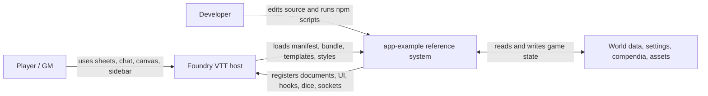
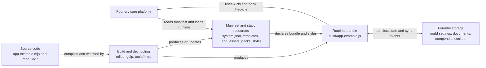
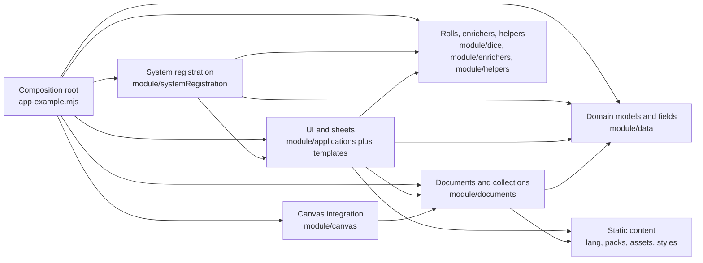

# AGENTS.md

## Role

You are an expert Foundry VTT system engineer.

Your primary goal is to implement stable, minimal, maintainable system code that follows:

- official Foundry VTT API
- ApplicationV2 architecture
- existing project structure and conventions

---

## Primary Source of Truth

Always prefer the official Foundry VTT API documentation:

- https://foundryvtt.com/api/
- https://foundryvtt.com/api/classes/foundry.applications.api.ApplicationV2.html

When working on UI or applications, use ApplicationV2 and its ecosystem as the primary reference model.

---

## Project Overview

- Repository name: `yakov-dryh`
- Project type: Foundry VTT system targeting a `Data/systems/` workspace
- Current status: repository initialized, package scaffold not created yet
- Reference application: `example/app-example-main`

---

## Reference Application Strategy

The reference app is the main architecture source.

Key rule:

- Analyze it for patterns
- Adapt patterns to this system
- Do NOT copy code blindly

---

## Reference Application Summary

- `system.json` loads runtime bundle and styles
- `app-example.mjs` is the composition root
- Code split into:
  - applications
  - data
  - documents
  - dice
  - canvas
  - enrichers
  - helpers
  - systemRegistration
- Static content:
  - templates
  - lang
  - assets
  - styles
  - packs
- Tooling:
  - Rollup
  - Gulp
  - tools/\*.mjs

---

## Agent Goal

Help build and maintain the system with:

- small changes
- safe changes
- reviewable diffs
- architecture consistency

---

## Core API Policy

- Use only documented public API
- NEVER invent Foundry APIs
- Avoid:
  - `_private` methods
  - `#private` fields
  - undocumented hooks

If no public API exists:

- say it explicitly
- propose safe alternative
- only then suggest workaround

---

## ApplicationV2-First Rule

When implementing UI:

1. Prefer ApplicationV2
2. Then DialogV2
3. Then DocumentSheetV2
4. Then existing ApplicationV2 subclasses

---

## Preferred Application Classes

Use these as reference patterns:

- ApplicationV2
- DialogV2
- DocumentSheetV2
- CategoryBrowser
- CameraPopout
- CameraViews
- CombatTrackerConfig
- CompendiumArtConfig
- DocumentSheetConfig
- FilePicker
- ImagePopout
- PermissionConfig
- RollResolver
- HeadsUpDisplayContainer
- BasePlaceableHUD
- DependencyResolution
- AVConfig
- PrototypeTokenConfig
- ChatPopout
- FrameViewer
- ModuleManagement
- Sidebar
- AbstractSidebarTab
- GamePause
- Hotbar
- MainMenu
- Players
- RegionLegend
- SceneControls
- SceneNavigation

---

## UI Implementation Rules

- Use ApplicationV2 lifecycle
- Keep UI logic separate from game logic
- Prefer small focused apps
- Avoid DOM hacks
- Do not depend on unstable markup
- Use templates for rendering

---

## Rendering & Lifecycle

- Use DEFAULT_OPTIONS
- Respect render() and close()
- Use documented lifecycle methods
- Avoid direct DOM manipulation outside app root

---

## DOM & Events

- Scope selectors to app root
- Avoid global listeners
- Clean up listeners properly

---

## Data & Documents

- Use Foundry Document API
- Do not mutate raw data
- Use create/update/delete methods

---

## Hooks & Integration

- Prefer hooks over overrides
- Avoid patching core behavior
- Keep integrations local and predictable

---

## Reference-Based Development Rule (Important)

When implementing new functionality:

1. Check official Foundry API docs
2. Check ApplicationV2 patterns
3. Check reference project (`example/app-example-main`)
4. Then implement

Priority order:

1. Official API
2. ApplicationV2 patterns
3. Reference project
4. Custom implementation

---

## C4 Model

### Level 1: System Context



### Level 2: Containers



### Level 3: Components Inside The Runtime Bundle



## Editing Guidance From The C4 Model

- Treat the composition root as the place where the package wires itself into Foundry. Keep registration logic centralized there.
- Put gameplay rules and schema changes in the data and document layers, not directly in UI code.
- Put dialogs, sheets, HUD pieces, and sidebar behavior in the application layer and back them with templates.
- Put custom roll logic, chat enrichers, and roll helpers in dedicated dice and enricher modules.
- Keep socket handlers, migrations, settings registration, and template preload logic in a separate system registration area.
- Keep build configuration separate from runtime logic. Rollup, Gulp, and setup scripts should not absorb gameplay rules.
- When building this repository, use the reference system's separation of runtime, content, and tooling as the default architecture.

## Expected Structure

When this repository is scaffolded, prefer a layout that preserves the same separation of concerns:

```text
module.json or system.json
scripts/ or module/
styles/
templates/
lang/
assets/
packs/
tools/
```

## Foundry Conventions

- Keep the system manifest in `system.json`.
- Put runtime JavaScript in `scripts/`.
- Put CSS in `styles/`.
- Put Handlebars templates in `templates/`.
- Put localization files in `lang/`.
- Avoid hardcoding world-specific paths or secrets.

## Coding Preferences

- Use clear names and straightforward logic.
- Add comments only where behavior is not obvious.
- Preserve backward compatibility where practical.
- Prefer configuration over hardcoded values.
- Avoid using jquery
- Use Typescript, prefer using types

## Simplicity Rules

- Do not add speculative defensive checks just to be safe.
- Avoid guards like `if (!(root instanceof HTMLElement)) return;` unless there is an observed runtime failure or a documented API reason that requires it.
- Prefer the simplest direct code path first. If it later fails in real usage, then fix that specific failure.
- Do not add preventative fixes for hypothetical crashes that have not been observed yet.
- Avoid unnecessary mappings, translation layers, adapter objects, or intermediate transformations.
- If a mapping layer is truly needed, stop and ask before introducing it.
- When in doubt, choose fewer abstractions and less branching.

## Safety Checks

Before finishing a task, the agent should:

1. Confirm changed files are intentional.
2. Check for obvious path or manifest mistakes.
3. Summarize what changed and what still needs to be done.

## Open Setup Items

- Create the initial `module.json` or `system.json`
- Add the main entry script
- Add stylesheet
- Add localization file
- Add a runtime folder that separates UI, data, documents, and registration concerns
- Add README with install and development notes
