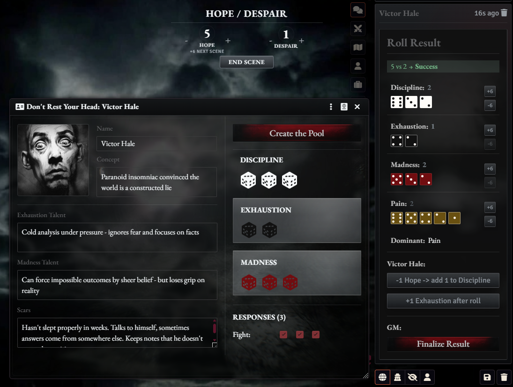

# Don't Rest Your Head for Foundry VTT

A fan-made, unofficial Foundry VTT system for playing `Don't Rest Your Head`.

The system focuses on the parts of play that are easiest to lose track of at
the table: character sheets, dice pools, Hope, Despair, and chat-based roll
resolution.

## Screenshot



## Installation

Requires Foundry VTT 13.

1. Open the Foundry VTT setup screen.
2. Go to **Game Systems**.
3. Click **Install System**.
4. Paste this manifest URL:

```text
https://github.com/iosipov27/yakov-dryh/releases/latest/download/system.json
```

5. Install the system.
6. Create a world using **Don't Rest Your Head**.

## What It Does

- Provides a `Character` actor type with a custom character sheet.
- Tracks name, concept, Discipline, Exhaustion, Madness, Responses, Talents, and
  Scars.
- Builds a dice pool from the character sheet.
- Rolls Discipline, Exhaustion, Madness, and Pain together.
- Counts successes and shows the dominant pool in chat.
- Supports Exhaustion, Madness, Discipline, Pain, failure outcomes, Snap, and
  Crash resolution.
- Tracks shared Hope and GM Despair.
- Holds newly gained Hope as pending Hope until the next scene.

## Getting Started

1. Create an actor with the `Character` type.
2. Open the character sheet.
3. Fill in the character's name, concept, talents, and scars.
4. Set Discipline, Exhaustion, and Madness.
5. Configure all three Responses as Fight or Flight.
6. Click **Create the Pool** on the character sheet.

The dice tray loads that character's pool and creates an interactive chat card.

## Rolling Dice

After a character pool is created:

- The player can adjust Discipline, Exhaustion, and Madness before rolling.
- The GM can adjust Pain.
- Click **Roll** to create the roll result in chat.
- The chat card shows successes, dominant pool, and available follow-up actions.
- Players can take Exhaustion, spend Hope when available, and resolve character
  consequences from the card.
- The GM can roll Pain and use Despair-based interventions when available.

## Interface Visibility

The system hides controls that are not useful for the current user.

- Players see their character pool controls, but do not see the Pain `+ / -`
  controls in the dice tray chat card.
- The GM sees and controls Pain in the dice tray chat card.
- Players do not see GM-only roll controls such as rolling Pain, spending
  Despair on `+6 / -6`, finalizing a roll, or resolving GM-only failure and
  Crash outcomes.
- The GM sees the GM-only controls when the current roll state allows them.
- Player-facing follow-up buttons appear only when they are available for that
  roll.
- Older roll cards remain in chat for reference, but only the latest active roll
  card is interactive.

## Hope And Despair

The Hope / Despair tracker is shared by the table.

- Hope belongs to the players as a shared pool.
- Despair belongs to the GM.
- Only the GM can directly change the shared Hope and Despair totals.
- Hope gained during a roll is added as pending Hope.
- Click **End Scene** to move pending Hope into the usable Hope pool.

## Common Issues

If **Create the Pool** is disabled, configure all three Responses on the
character sheet first.

If the dice tray says there is no active character, open a character sheet and
click **Create the Pool** again.

If Hope or Despair controls are locked, check whether you are logged in as the
GM.

## Credits

- **jabberrrwocky** - UI feedback and playtesting.
  Discord: `jabberrrwocky`
  itch.io: https://dr-jabberwocky.itch.io/
- **super8.ai** - UI feedback and playtesting.
  Discord: `super8.ai`
  itch.io: https://8super8.itch.io/
