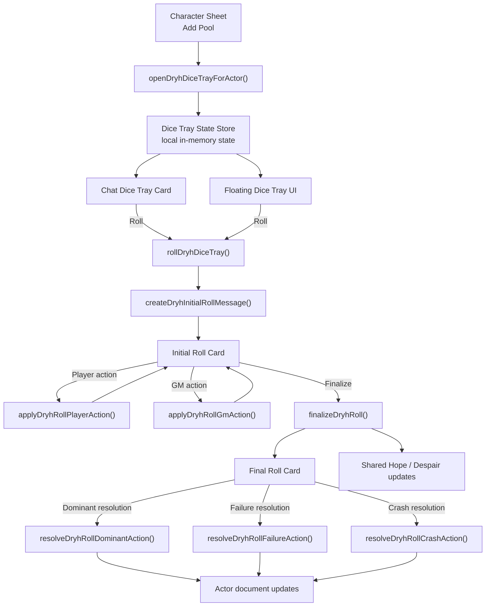

# yakov-dryh

Minimal Foundry VTT system scaffold for `Data/systems/yakov-dryh`, built around Foundry V13 APIs and an ApplicationV2-first architecture.

## Installation

Install in Foundry VTT with this manifest URL:

```text
https://github.com/iosipov27/yakov-dryh/releases/latest/download/system.json
```

Foundry will download the packaged system from the latest GitHub Release asset declared in `system.json`.

## Current Scope

- `system.json` manifest with a runtime bundle, stylesheet, localization, and a seeded `character` Actor subtype
- `src/main.ts` composition root
- `src/module/applications` for ApplicationV2 and sheet classes
- `src/module/data` for system-facing document type constants and future data model scaffolding
- `src/module/documents` for custom document classes
- `src/module/system-registration` for Foundry init-time registration work
- `templates/`, `styles/`, and `lang/` for static package resources

## Chat Flow Overview



Notes:

- The dice tray state is client-local and no longer persisted through `game.settings` on every `+/-`.
- The chat dice tray card sync is debounced, while roll resolution still persists through Foundry documents and chat messages.

## Development

Install dependencies:

```bash
npm install
```

Build the runtime bundle and stylesheet:

```bash
npm run build
```

The release workflow builds fresh `scripts/` and `styles/` assets before packaging the Foundry install zip. Local `scripts/` output is kept for development, but it is not required to stay tracked in Git.

## Release Flow

Push a version tag such as `v0.1.0` to trigger the GitHub Actions release workflow.

The workflow:

- installs dependencies
- rebuilds `scripts/` and `styles/`
- verifies that the tag version matches `system.json`
- packages a Foundry-ready `yakov-dryh.zip`
- publishes both `yakov-dryh.zip` and `system.json` to the GitHub Release

You can also re-run the workflow manually for an existing tag from the Actions tab by providing the tag name.

Run linting:

```bash
npx eslint src --ext .ts
```

Run tests:

```bash
npx vitest run
```

## Foundry Notes

- The current document scaffold registers a custom `Actor` class and a default Actor sheet for the `character` subtype.
- The `documentTypes.Actor.character` manifest entry makes that subtype valid to the Foundry server.
- The `data` layer is intentionally light right now. A natural next step is adding `TypeDataModel` classes and pairing them with `CONFIG.Actor.dataModels`.

## Reference Material

- Official API: https://foundryvtt.com/api/
- `ApplicationV2`: https://foundryvtt.com/api/classes/foundry.applications.api.ApplicationV2.html
- System development guide: https://foundryvtt.com/article/system-development/
- Local architecture reference: `example/app-example-main`
