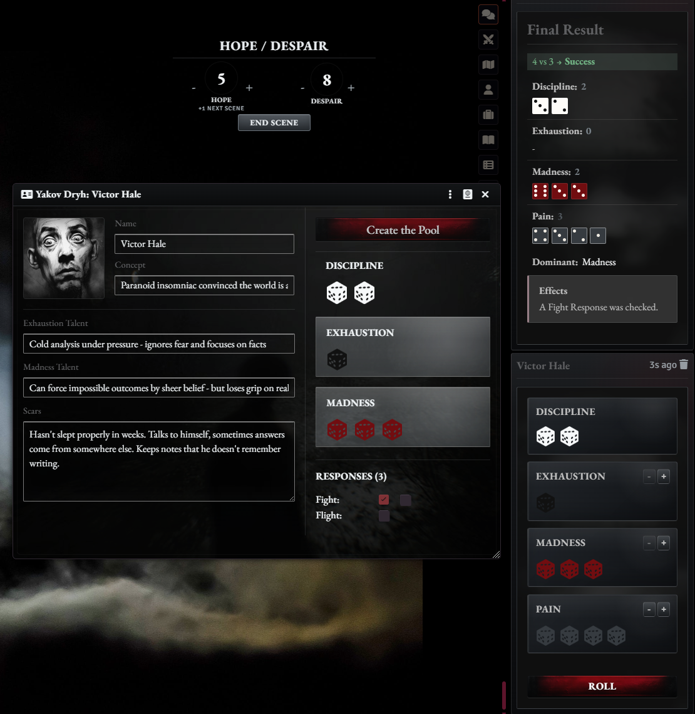

# yakov-dryh

Minimal Foundry VTT system for `Data/systems/yakov-dryh`.

## Screenshot



## Installation

Install in Foundry VTT with this manifest URL:

```text
https://github.com/iosipov27/yakov-dryh/releases/latest/download/system.json
```

Foundry will download the packaged system from the latest GitHub Release asset declared in `system.json`.

## Current Features

- Character sheet with name, concept, Discipline, Exhaustion, Madness, Responses, Talents, and Scars.
- Dice Tray flow that loads a character pool from the sheet and rolls Discipline, Exhaustion, Madness, and Pain together.
- Pre-roll and post-roll options for adding Exhaustion, plus Hope spending to improve a roll.
- GM controls for Pain dice and a post-roll `+6` or `-6` intervention.
- Automatic success counting, dominant pool calculation, and chat result cards.
- Resolution support for Discipline, Madness, Exhaustion, Pain, failure outcomes, Snap, and Crash.
- Shared Hope and Despair pools with a visible tracker and pending Hope that unlocks next scene.

## Development

Install dependencies:

```bash
npm install
```

Build the runtime bundle and stylesheet:

```bash
npm run build
```

The release workflow builds fresh `scripts/` and `styles/` assets before packaging the Foundry install zip. Local `scripts/` output is kept for development, but it is not required to stay tracked in Git.

## Release Flow

Push a version tag such as `v0.1.0` to trigger the GitHub Actions release workflow.

The workflow:

- installs dependencies
- rebuilds `scripts/` and `styles/`
- verifies that the tag version matches `system.json`
- packages a Foundry-ready `yakov-dryh.zip`
- publishes both `yakov-dryh.zip` and `system.json` to the GitHub Release

You can also re-run the workflow manually for an existing tag from the Actions tab by providing the tag name.

Run linting:

```bash
npx eslint src --ext .ts
```

Run tests:

```bash
npx vitest run
```

## Reference Material

- Official API: https://foundryvtt.com/api/
- `ApplicationV2`: https://foundryvtt.com/api/classes/foundry.applications.api.ApplicationV2.html
- System development guide: https://foundryvtt.com/article/system-development/
