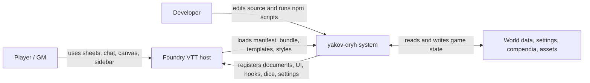
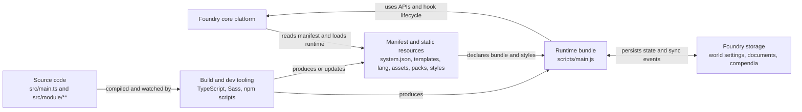
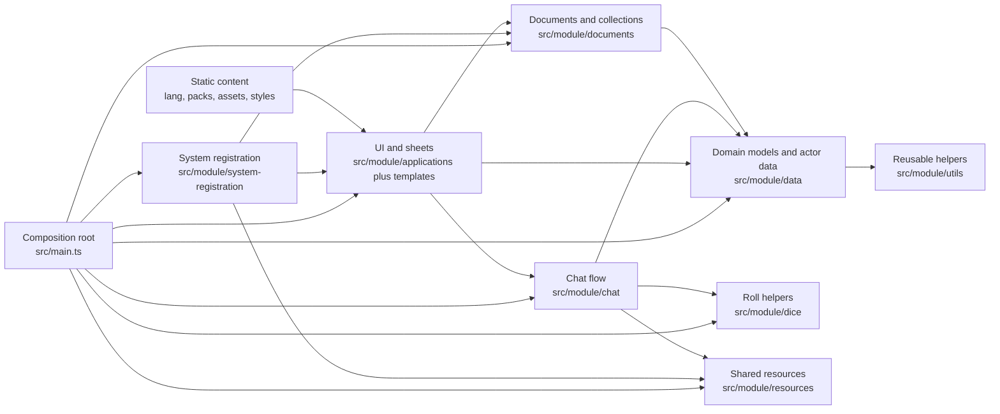

# Architecture

This document is a practical map of the `yakov-dryh` system.

It is meant to answer:

- where a feature starts
- which files own the runtime behavior
- which state is local UI state vs persisted Foundry state
- where to add tests when a subsystem changes

## System Shape

At a high level the system is split into:

- `src/main.ts`
  - composition root
- `src/module/system-registration`
  - Foundry bootstrap and registration
- `src/module/applications`
  - ApplicationV2 sheets, dialogs, and floating UI
- `src/module/chat`
  - chat card creation, interaction, roll flow, and resolution
- `src/module/dice`
  - pure dice and dominant-pool logic
- `src/module/data`
  - normalized actor-facing data and rules-oriented helpers
- `src/module/resources`
  - shared Hope / Despair state
- `templates`
  - Handlebars views
- `src/styles`
  - source SCSS
- `styles`
  - built runtime CSS
- `tests`
  - focused unit tests around rules and presentation helpers

## Bootstrap

Entry point:

- `src/main.ts`

Main registration flow:

- `src/module/system-registration/index.ts`

What happens during startup:

1. `init`
2. register document classes
3. register settings
4. register sheets
5. register chat hooks
6. preload Handlebars templates
7. `ready`
8. render the always-visible Hope / Despair tracker

Important registration files:

- `src/module/system-registration/documents.ts`
- `src/module/system-registration/settings.ts`
- `src/module/system-registration/sheets.ts`
- `src/module/system-registration/templates.ts`

## Core Runtime Areas

### Character Sheet

Primary files:

- `src/module/applications/sheets/character-sheet.ts`
- `src/module/applications/sheets/character-sheet-context.ts`
- `src/module/applications/sheets/character-sheet-response-helpers.ts`
- `src/module/applications/sheets/character-sheet-pool-helpers.ts`
- `templates/sheets/character-sheet.hbs`
- `templates/sheets/parts/character-sheet-*.hbs`

Responsibilities:

- render the character sheet
- manage local edit mode for Discipline, Exhaustion, Madness, and Responses
- persist actor updates
- gate `Add Pool` until all 3 response slots are configured
- open the dice tray for the current actor

Design note:

- pool edit mode is local draft UI inside the sheet
- actor data is only persisted on explicit save actions

### Dice Tray

Primary files:

- `src/module/applications/ui/dice-tray.ts`
- `src/module/applications/ui/dice-tray-state.ts`
- `src/module/chat/dice-tray-card-service.ts`
- `src/module/chat/dice-tray-card-presentation.ts`
- `templates/ui/dice-tray.hbs`
- `templates/chat/dice-tray-card.hbs`

There are two tray surfaces:

- floating tray window
- chat dice tray card

The floating tray is fed by the local tray state store. The active chat dice
tray card also stores a normalized state snapshot in its message flag so GM and
player clients can interact with the same pool values.

State ownership:

- `src/module/applications/ui/dice-tray-state.ts`

Important current rule:

- floating tray state is client-local in memory
- active chat tray state is mirrored into the dice tray card message flag
- tray state is not persisted through `game.settings` on every `+/-`

That means:

- `+/-` actions are cheap local state updates
- the tray state store emits changes to listeners
- the chat tray card syncs through Foundry chat message updates when needed
- chat card permissions are recalculated per rendering client, not trusted from
  the stored HTML
- roll execution reads structured tray state, either from the active chat card
  flag or from the local tray state store, not from saved chat HTML

Key functions:

- `createDefaultDiceTrayState()`
- `adjustDiceTrayStatePool()`
- `loadActorIntoDiceTray()`
- `adjustDiceTrayPool()`
- `getDiceTrayState()`
- `subscribeToDiceTrayStateChanges()`

### Roll Flow

Primary files:

- `src/module/chat/index.ts`
- `src/module/chat/roll-card-service.ts`
- `src/module/applications/dialogs/roll-dialog.ts`
- `src/module/applications/dialogs/pain-roll-dialog.ts`
- `src/module/system-registration/sockets.ts`
- `src/module/dice/roll.ts`
- `src/module/dice/index.ts`
- `templates/chat/roll-card.hbs`
- `templates/dialogs/roll-dialog.hbs`
- `templates/dialogs/pain-roll-dialog.hbs`

The roll pipeline:

1. player opens tray from the sheet
2. tray state is initialized from actor data
3. tray chat card is created or updated
4. player and GM adjust pools through the shared chat card state
5. roll is executed from structured tray state
6. an initial roll card is created in chat
7. player and GM post-roll actions can modify the result
8. finalization creates a final roll card
9. final resolution updates actor state and shared resources

The most important service here is:

- `src/module/chat/roll-card-service.ts`

It owns:

- chat card rendering
- roll card flag data
- player post-roll actions
- player-facing roll action socket requests for GM-owned updates
- GM six-adjustment actions
- dominant effect application
- failure resolution
- crash resolution
- final roll publication

### Shared Hope / Despair

Primary files:

- `src/module/resources/shared-pools.ts`
- `src/module/resources/index.ts`
- `src/module/applications/ui/hope-despair-tracker.ts`
- `src/module/applications/ui/hope-despair-tracker-presentation.ts`
- `templates/ui/hope-despair-tracker.hbs`

State ownership:

- shared table resources are persisted through Foundry settings

This is different from the dice tray.

Use this subsystem for:

- current Hope
- current Despair
- pending Hope
- end scene conversion from pending Hope to active Hope

## Data Ownership

The project intentionally separates local UI state from persisted game state.

### Persisted Actor State

Owned by actor updates:

- Discipline
- Exhaustion
- permanent Madness
- configured and checked Responses
- talents
- scars

Relevant files:

- `src/module/data/actor.ts`
- `src/module/applications/sheets/character-sheet.ts`
- `src/module/chat/roll-card-service.ts`

### Persisted Shared Table State

Owned by settings:

- shared Hope
- shared Despair
- pending Hope

Relevant files:

- `src/module/resources/shared-pools.ts`
- `src/module/system-registration/settings.ts`

### Local UI State

Owned only in memory:

- sheet edit drafts for pools
- sheet response edit draft

Dice tray pool drafts are local while editing the floating tray, then mirrored
into the active chat card flag once a card exists.

Relevant files:

- `src/module/applications/ui/dice-tray-state.ts`
- `src/module/applications/sheets/character-sheet.ts`

## Chat Data Model

Chat behavior is driven by message flags, not by scraping the visible DOM.

Primary flags:

- dice tray card flag
- roll card flag

Important files:

- `src/module/chat/dice-tray-card-service.ts`
- `src/module/chat/roll-card-service.ts`
- `src/module/constants.ts`

Why this matters:

- old messages can remain in chat history
- rendering should be reproducible from structured data
- logic should not depend on the exact HTML that was previously rendered

## Rules Helpers

The project keeps reusable rules logic in small focused modules.

Key rules files:

- `src/module/dice/roll.ts`
  - roll result creation
  - success counting
  - dominant pool logic
- `src/module/chat/dominant-resolution.ts`
  - dominant resolution options
- `src/module/chat/failure-consequence.ts`
  - failure consequence selection
- `src/module/chat/failure-resolution.ts`
  - failure action buttons and behavior
- `src/module/chat/crash.ts`
  - crash triggers and crash resolution
- `src/module/chat/snap.ts`
  - snap rules and actor-state updates
- `src/module/chat/shadow-casting.ts`
  - GM six adjustment Hope / Despair side effects

Use these modules before adding logic directly to UI classes.

## Templates And Styles

Templates:

- `templates/chat`
  - roll and tray cards
- `templates/dialogs`
  - roll and pain dialogs
- `templates/sheets`
  - character sheet
- `templates/ui`
  - floating tray and tracker

Styles source of truth:

- `src/styles/yakov-dryh.scss`

Important partials:

- `src/styles/partials/_variables.scss`
- `src/styles/partials/_typography.scss`
- `src/styles/partials/_surfaces.scss`
- `src/styles/partials/_sheet.scss`
- `src/styles/partials/_controls.scss`
- `src/styles/partials/_rolls.scss`
- `src/styles/partials/_hud.scss`
- `src/styles/partials/_responsive.scss`

Build output:

- `styles/yakov-dryh.css`
- `styles/yakov-dryh.css.map`

Rule of thumb:

- edit SCSS in `src/styles/**`
- do not hand-edit `styles/**`

## Typical Change Guide

### If you change character sheet behavior

Look at:

- `src/module/applications/sheets/character-sheet.ts`
- `src/module/applications/sheets/character-sheet-context.ts`
- `templates/sheets/parts/*`
- `tests/character-sheet-context.test.ts`
- `tests/response-slots.test.ts`

### If you change dice tray behavior

Look at:

- `src/module/applications/ui/dice-tray-state.ts`
- `src/module/applications/ui/dice-tray.ts`
- `src/module/chat/dice-tray-card-service.ts`
- `src/module/chat/index.ts`
- `tests/dice-tray-state.test.ts`
- `tests/dice-tray-card-service.test.ts`
- `tests/dice-tray-card-presentation.test.ts`

### If you change roll result behavior

Look at:

- `src/module/chat/roll-card-service.ts`
- `src/module/dice/roll.ts`
- `src/module/chat/*resolution*.ts`
- `tests/roll-card-actions.test.ts`
- `tests/dryh-roll.test.ts`
- `tests/shadow-casting.test.ts`
- `tests/crash.test.ts`
- `tests/snap.test.ts`

### If you change Hope / Despair behavior

Look at:

- `src/module/resources/shared-pools.ts`
- `src/module/applications/ui/hope-despair-tracker.ts`
- `tests/shared-pools.test.ts`
- `tests/setting-change.test.ts`
- `tests/hope-despair-tracker-presentation.test.ts`

## Current Architectural Tradeoffs

These are intentional current choices:

- floating tray state is local for speed
- active chat tray state is mirrored in message flags for cross-client actions
- shared pools are persisted in settings for table-wide sync
- chat cards are structured around Foundry message flags
- player roll actions that touch shared world data are mediated through the
  active GM client
- rules logic is mostly separated from ApplicationV2 classes
- tests focus on pure helpers and service-layer logic rather than full Foundry browser integration

## Known Pressure Points

These are the areas most likely to need care during refactors:

- chat card rerender behavior and message update frequency
- tray sync between local state and chat presentation
- final roll card resolution text composition
- response configuration and response-check side effects
- shared Hope / pending Hope / Despair interactions after finalization

## C4 Reference

### Level 1: System Context

### Level 2: Containers

### Level 3: Components Inside The Runtime Bundle

## Recommended Reading Order

If you are new to the project, read files in this order:

1. `README.md`
2. `AGENTS.md`
3. `src/main.ts`
4. `src/module/system-registration/index.ts`
5. `src/module/applications/sheets/character-sheet.ts`
6. `src/module/applications/ui/dice-tray-state.ts`
7. `src/module/chat/dice-tray-card-service.ts`
8. `src/module/chat/roll-card-service.ts`
9. `src/module/resources/shared-pools.ts`
10. the relevant tests for the subsystem you are touching
